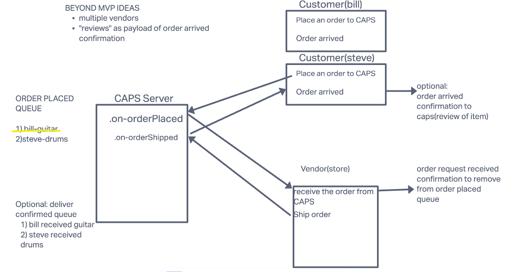

# Lab 14: Pair Programming Project

## Authors: Keelen Fisher, Kris Dunning

## Project Name: driven-application-event-project

## Store Idea: Kenny G's Saxophone 'n More Store

## Project Idea

- Instrument Hub: Where you can chose your instrument to buy and we'll get them ready for you!

## Requirements

### Your application must employ the following programming concepts

- A “hub” server that moderates all events

- Multiple “clients” that connect to the hub which can both publish and subscribe to events

- Must operate over a network

- 10/07/2022
  - implement the queue functionality
  - Message client interface
  - Customize message and the event

## Stretch Goals

- Generated list of instruments from every event object.
- Can see the the stored event in the queue when you turn the vendor.
- Front end -> displays the event on a deployed site and actually practice CSS.
